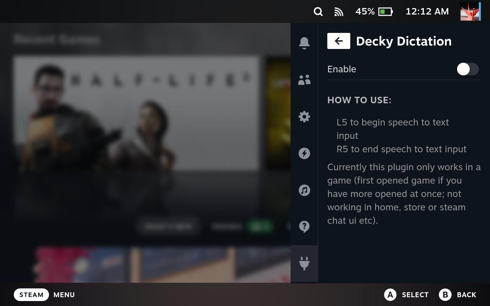

# Decky Dictation

Allows speech to text input using [Vosk](https://github.com/alphacep/vosk-api) and [Nerd Dictation](https://github.com/ideasman42/nerd-dictation)

This plugin was made with the [decky-plugin-template](https://github.com/SteamDeckHomebrew/decky-plugin-template)

**This plugin is still in WIP!**

### Changelog
- 1.0.0 - change hotkeys to avoid collision with steamOS
- 0.2.0 - decky-dictation is born, also added timeout, sentences, casing and punctuation for nerd-dictation
- 0.1.0 - initial version

### Nice to have
- Allow support for mode switching and implement persistent config settings; add new push to talk mode (hold STEAM + B + L2)
- Implement support for downloading and selecting other models at runtime (some more advanced models are too large to store on git; shippable stays with the small model)

### Known issues
- Currently this plugin only works in a game in game mode (first opened game if you have more opened at once; not working in home, store or steam chat ui etc).

### Thanks
- Thanks to [u/TheSheepAdam](https://www.reddit.com/user/TheSheepAdam/) for the [proof of concept](https://www.reddit.com/r/SteamDeck/comments/wuajgy/dictation_speech_to_text_proof_of_concept_vosk/) 
- Thanks to [@marissa999](https://github.com/marissa999) for [decky-recorder](https://github.com/marissa999/decky-recorder) which has been used as a template for this plugin

### Building
If you want to build this plugin in theory you only need to run build-zip.sh. You will need the following:
- npm
- pnpm
- python + pip
- Docker
- zip

I only tested this on macOS.
